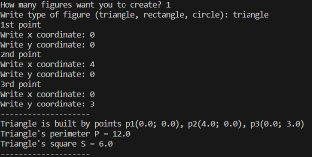
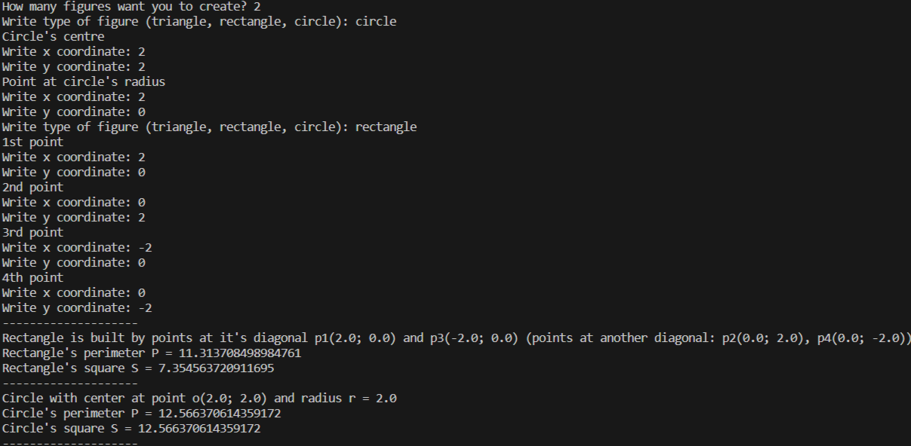

# OOP3    
    
## Исполнитель    
ФТ-220007 Фадеев Алексей    
    
## Задача    
п. 1 - Класс "Фигура"    
Создать класс "Фигура" с несколькими методами (вывод на экран, расчет периметра/площади). Показать что класс работает.        
п. 2 - Наследники    
Создать класс "Треугольник" как наследник класса "Фигура". Переопределить в нем (при необходимости) методы вывода, расчетов.    
Добавить еще наследников класса фигура — круг и четырехугольник. Четырехугольники считать выпуклыми. Можно использовать только прямоугольные четырехугольники.    
Показать что программа работает с новыми классами.        
п. 3 - Точки    
Добавить отдельно класс "Точка". В классе добавить координаты.    
Показать что программа работает с новым классом.        
п. 4 - Добавить "Точки" в п.2    
В классы "Треугольник", "Круг" и т.п. добавить поля с точками.  Например, класс Треугольник должен содержать три точки. Изменить методы с учетом новых данных.    
Показать что программа работает.        
п. 5 - фигура -  абстракный класс    
Класс Фигура сделать абстрактным. В нем оставить расчет периметра и площади, ввод, вывод фигуры.        
п. 6 - Список разных фигур    
Создать массив(или вектор, список) различных фигур. У пользователя спрашивать сколько фигур ему надо. Для каждой фигуры спрашивать ее тип, создавать нужную фигуру, вводить ее данные, рассчитывать площадь.        
п. 7  - Сортировка    
После создания всех фигур отсортировать их по площади и вывести все вместе красиво (например, таблицей).        
п. 8 ** - Трехмерные, полярные координаты. Работа с файлами    
Добавить константу или переменную (запрашивать у пользователя в начале работы всей программы). Можно несколько констант или переменных.    
По ним определять размерность пространства (двумерное, трехмерное , N- мерное) и вид координат (декартовы или полярные). От этих констант должен зависеть минимум кода в программе (расчет расстояния, ввод/вывод точки).    
Для желающих: дополнительно добавить константу/переменную, по которой определять как проводить ввод/ вывод: на экран или в файл.    
    
## Тесты    
    
    
    
Как видно из теста №3 программа не будет работать корректно с прямоугольниками, повёрнутыми относительно координатных осей, поэтому настоятельно рекомендуется стороны прямоугольника ориентировать параллельно координатным осям.
